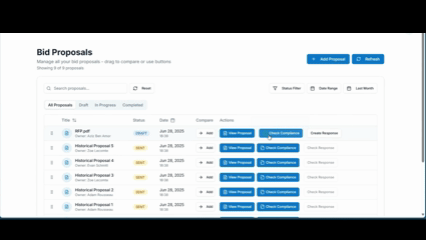

# AI-Powered Bid Proposal Assistant

A full-stack application for managing bids, leveraging AgenticAI to automate bid proposal management, ensure accuracy, and enable strategic decision-making while keeping sensitive data secure.

## Demo

<p align="center">
  
</p>


## Cloning the Repository

1. Clone the repository:
   ```
   git clone git@github.com:aziz0220/Bid_Assistant.git
   cd Bid_Assistant
   ```

2. Initialize and update submodules:
   ```
   git submodule update --init --recursive
   ```

## Features

- **RFP Analysis**: Extracts requirements, deadlines, summaries, and compliance checks.
- **Opportunity Scoring**: Compares RFPs to identify promising bids with pertinence indicators and estimated scores.
- **AI-Assisted Writing**: Provides draft responses for bid writers.
- **Real-Time Collaboration**: Task assignments, notifications, and version history.
- **Multi-Agent Workflows**: Includes Chunk Validation, Requirement Extractor, Compliance Detector, Deadline Extractor, Summary Agent, and Company Extractor agents.
- **Administration**: Manage users, AI models, parameters, and system health.

## Overview

The AI-Powered Bid Proposal Assistant designed to tackle the challenges in responding to high-stakes Request for Proposals (RFPs) in the consulting world. It automates tedious parts of bid proposal management, such as requirement extraction, compliance checking, and response drafting, using on-premise Small Language Models (SLMs) to maintain data sovereignty and reduce costs.

## Problem Statement

In the consulting industry, firms must quickly respond to RFPs with compelling bid proposals that demonstrate technical understanding, meet requirements, and offer competitive offers under tight deadlines. Manual processes like reviewing RFPs, extracting requirements, and writing proposals from scratch are time-consuming and error-prone. Existing tools often lack intelligence, are cloud-based (raising data security concerns), or are generic and not tailored to complex RFPs.

## Solution

Our solution stands out by deeply analyzing RFPs while respecting data sovereignty. Unlike cloud-based alternatives, it uses on-premise SLMs, reducing costs and ensuring full control. The system is built for key users: Bid Writers, Managers, and Administrators, supporting use cases like RFP upload and analysis, requirement extraction, compliance detection, opportunity scoring, and AI-assisted response writing.

Key differentiators:
- On-premise AI deployment for data privacy and independence.
- Multi-agent architecture for efficient, modular workflows.
- Integration of local models via Ollama, optimized through quantization.

## Architecture

The system follows a modular, scalable design with classes like User, RFP, and AI_Agent. It includes:
- **Frontend**: Built with Next.js for a user-friendly interface.
- **Backend**: Powered by Spring Boot for service management.
- **Database**: PostgreSQL for structured data storage.
- **File Storage**: MinIO for secure file handling.
- **AI Module**: Leverages SLMs via Ollama for local deployment.
- **Security**: Azure authentication.

The AI agents are orchestrated using LangGraph, starting from prototyping with N8N and evolving to coded workflows for evaluation, streaming, and monitoring.

## Development Process

Developed using Scrum methodology over six two-week sprints from February to May 2025. Three releases:
- **Release 1**: Core infrastructure, authentication, file storage, initial AI integration.
- **Release 2**: Local AI workflows, prototyping, compliance engine.
- **Release 3**: Performance optimization, real-time collaboration, version history.

## Links


For more details, check out the following links:
- **Report**: https://drive.google.com/file/d/1zBePZ-oE9_mXGzI8510MQTbOyPD2kRAO/view?usp=sharing
- **Video demo**: https://drive.google.com/file/d/1-X6eMkb8bY2qi-1f2DY8bVgvUXw9RKBZ/view?usp=sharing
- **Presentation**: https://www.canva.com/design/DAGxeOpOePw/n0xm_uw2k25kjexhF-IQxg/edit?utm_content=DAGxeOpOePw&utm_campaign=designshare&utm_medium=link2&utm_source=sharebutton
